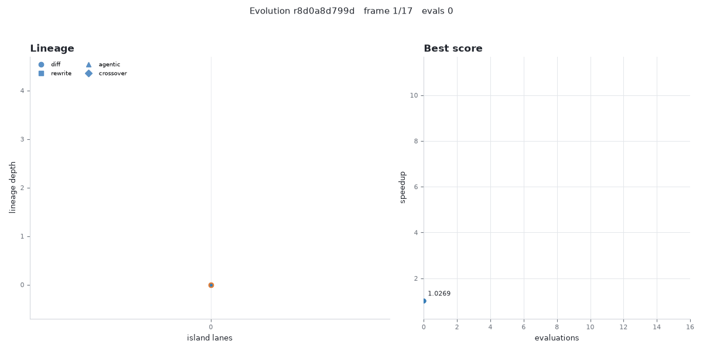
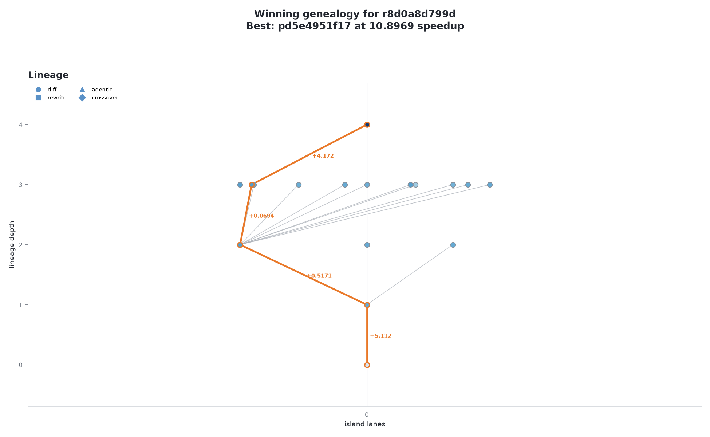
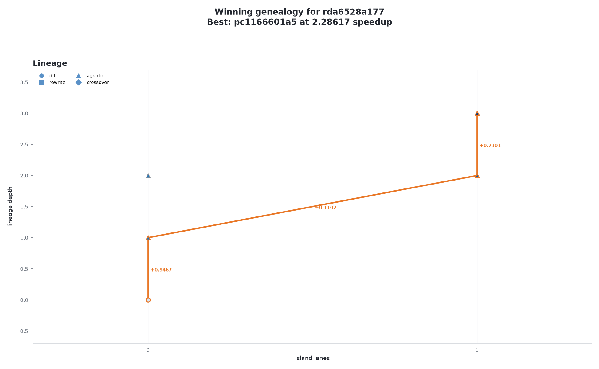

# autoevolve

Agent-native evolutionary optimization. You state a goal in english. The system
synthesizes a scoring contract, measures the baseline, checks feasibility, then
evolves code toward the target with a parallel population of coding-agent
workers, and ships the result as a report or a PR.

The promise on every run: hit the target, or deliver best-found plus an
evidence-backed explanation of the ceiling. Both are successful outcomes.

## What a run looks like



The goal above was "make the image pipeline at least 10x faster" (run r8d0a8d799d)
with outputs required identical. The engine locked a contract with metric
speedup and target 10 for run r8d0a8d799d, gated on exact output equality. Evolution
reached a measured 10.90x speedup at evaluation 16 of 200 in run r8d0a8d799d,
using only the cheap diff operator, seed 47, replayable. The winning program
discovered numpy vectorization inside the mutable region and wrapped its
arrays to stay list-compatible so the equality gate kept passing.



Full report for this run: [docs/gallery/r8d0a8d799d-report.md](docs/gallery/r8d0a8d799d-report.md)

## Any agent can join a run

One run was served over MCP streamable HTTP and worked simultaneously by a
Claude Code session and a Codex session. Both called join_run on the same
population, both submitted gate-checked mutations, and the islands table
records both runtimes (run rda6528a177, 4 non-seed programs).



## Quickstart

```sh
git clone https://github.com/RightNow-AI/autoevolve && cd autoevolve && uv sync
uv run autoevolve run --evaluator evaluators/python-speedup --budget-evals 200 --target 10 --operators diff
uv run autoevolve watch <run_id>
```

Add `--parallel N` to drive one run with N workers. A cycle spends nearly all
of its wall clock waiting on a model call, so workers overlap and throughput
scales close to linearly: run r0217367e52 measured 12.6 seconds per child on
four workers against 62.7 in run r8d0a8d799d on one.

Model access resolves from the environment: set AUTOEVOLVE_LOCAL_BASE_URL for
a local OpenAI-compatible engine (no key needed), or OPENAI_API_KEY with
AUTOEVOLVE_MODEL (plus optional OPENAI_BASE_URL) for a cloud endpoint. Every
run requires a budget bound and every number it reports carries its run id.

## How it works

1. English in, contract out. Before any compute burns, autoevolve synthesizes
   or loads `evaluate.py`, measures the baseline three times, computes a
   feasibility ceiling where possible, and locks the contract. A target above
   the ceiling stops the run before evolution with the analysis as the result.
2. The agent is the mutation operator. Claude Code and Codex sessions mutate
   candidates. They can profile, read failure reasons, and debug the
   evaluator. The cheap diff path handles bulk throughput; agentic dives
   handle the hard jumps.
3. The population outlives sessions. All evolution state lives in one SQLite
   store owned by the autoevolve server. Workers are stateless and
   disposable. Any MCP-speaking agent joins a run mid-flight with join_run.
4. It gets smarter every run. Top lineage diffs are distilled into a
   discovery ledger that future runs sample into mutation context.
5. It evolves itself. Operator selection is a persistent per-domain UCB1
   bandit over measured child-improvement rates.

## Surfaces

| surface | shape |
|---|---|
| CLI | `autoevolve init\|run\|watch\|join\|report\|render\|serve\|campaign` |
| MCP server + skill | `autoevolve serve [--http]`; the skill in skill/ teaches any agent the worker loop |
| GitHub issue mode | issue in, contract proposal comment, evolve:approved label as the consent record, evolution with milestone comments, artifact-embedded PR out |
| Dashboard | self-contained dashboard.html plus evolution.gif plus lineage poster per run |

## Use it on your own repository

Copy `autoevolve/gh/workflow-template.yml` to `.github/workflows/evolve.yml`,
create the `evolve` and `evolve:approved` labels, and add a model endpoint
secret. Then open an issue titled `evolve: make X faster`. autoevolve replies
with the contract it would measure against, and nothing executes until a
maintainer with write access applies `evolve:approved`. That label is the
consent record. The run ends with a pull request carrying the winning code,
the report, and the artifacts.

## Evaluator packs

Four bundled packs under evaluators/, each obeying docs/CONTRACT.md:
python-speedup, triton-kernel (honest CPU mock without a GPU, roofline ceiling
with one), routing-heuristic, symbolic-regression on the Nguyen-7 benchmark.
Write your own with `autoevolve init <name>`.

## Research campaigns

Four campaign packs under campaigns/ aim the engine at discovery:
kernel-frontier, arch-search, algorithm-frontier, equation-discovery. Every
campaign enforces the promotion ladder and the claims policy in code; a
measured claim without a run id fails the test suite.

## Any domain, not just code

Nothing in the engine knows what a kernel or a graph is. The evaluator is the
domain, so adding one means writing roughly two hundred lines, not changing
the system. What decides whether a domain works is whether a candidate answer
can be checked by a program, cheaply, with partial credit. docs/DOMAINS.md
gives the three questions, the certificate taxonomy, and worked answers for
AI algorithms, space, vehicles, vision, language, and mathematics, including
which parts of each are honestly out of reach.

## Honesty

docs/HONESTY.md is enforced, not aspirational. Measured-or-null, run ids on
every number, failure reported as a first-class result, proxy wins always
labeled proxy wins.

## Docs

- docs/ARCHITECTURE.md is the normative module and interface spec.
- docs/CONTRACT.md is the normative evaluator contract.
- docs/CAMPAIGNS.md is the campaign pack format.
- CLAUDE.md is the constitution this repository is built under.

## License

Apache-2.0
